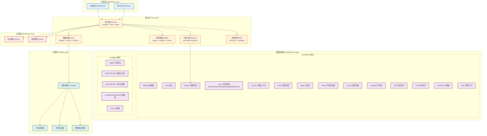

# go-casbin 企业级权限管理系统

## 🎯 项目简介

go-casbin 是一个企业级的权限管理系统，基于 Go 语言开发，深度集成 [go-toolbox](https://github.com/kamalyes/go-toolbox) 和 [go-logger](https://github.com/kamalyes/go-logger)，提供全面、高效、可扩展的权限控制解决方案。

### 核心特性

- 📦 **全面性设计**：完整支持 ACL、RBAC、ABAC 等多种权限模型
- 🔧 **高度可扩展**：基于接口的适配器模式，支持自定义存储后端
- 🚀 **高性能**：利用 go-toolbox 的 syncx.Map、WorkerPool、对象池等优化并发性能
- 🛡️ **高可用**：集成 breaker 熔断器 + retry 重试机制，保障系统稳定性
- 🔍 **可观测性**：深度集成 go-logger，支持结构化日志、分布式追踪、Console风格
- 🔄 **热更新**：策略和配置支持运行时热加载，无需重启
- ⚡ **规则引擎**：基于 go-toolbox matcher 的高性能规则匹配引擎
- 🔐 **安全脱敏**：集成 desensitize 模块，日志自动脱敏

## 🏗️ 架构设计

### 架构层次图



## 📁 目录结构

```
go-casbin/
├── enforcer/                 # 核心执行器
│   ├── enforcer.go           # 执行器主体（breaker + retry + idgen）
│   ├── matcher.go            # 匹配引擎（基于 go-toolbox/matcher）
│   └── options.go            # 配置选项（链式调用）
├── model/                    # 模型管理
│   ├── model.go              # 模型定义与核心操作
│   ├── assertion.go          # 断言定义（r/p/g/e/m 各段）
│   ├── loader.go             # 模型加载器（文件/字符串）
│   ├── validator.go          # 模型验证器（完整性检查）
│   └── parser.go             # 模型解析器（CONF格式解析）
├── policy/                   # 策略管理
│   ├── policy.go             # 策略定义与核心操作
│   ├── adapter.go            # 适配器接口 + 文件适配器
│   ├── cache.go              # 策略缓存（基于 syncx.Map）
│   ├── watcher.go            # 策略监听器（文件变更检测）
│   └── effect.go             # 策略效果评估器
├── role/                     # 角色管理
│   ├── role.go               # 角色定义与接口
│   ├── hierarchy.go          # 角色层级管理（继承/循环检测）
│   └── manager.go            # 角色管理器（缓存 + 并发安全）
├── config/                   # 配置管理
│   ├── config.go             # 配置加载与解析
│   └── watcher.go            # 配置热更新监听
├── monitor/                  # 监控管理
│   ├── monitor.go            # 监控管理器
│   ├── metrics.go            # 指标收集（基于 atomic）
│   └── health.go             # 健康检查
├── errors/                   # 错误定义
│   └── errors.go             # 统一错误（基于 errorx）
├── resources/                # 资源文件目录（路径可自定义）
│   ├── rbac_model.conf       # RBAC 模型配置
│   ├── rbac_policy.csv       # RBAC 策略配置
│   └── abac_model.conf       # ABAC 模型配置
├── go.mod
└── README.md
```

## 🚀 快速开始

### 安装

```bash
go get github.com/kamalyes/go-casbin
```

### 基本使用 - RBAC

```go
package main

import (
    "github.com/kamalyes/go-casbin/enforcer"
    "github.com/kamalyes/go-logger"
)

func main() {
    log := logger.NewLogger().
        WithLevel(logger.INFO).
        WithShowCaller(true)

    // 创建执行器
    e, err := enforcer.NewEnforcer(
        enforcer.WithModelPath("resources/rbac_model.conf"),
        enforcer.WithPolicyPath("resources/rbac_policy.csv"),
        enforcer.WithLogger(log),
    )
    if err != nil {
        log.Fatal("Failed to create enforcer: %v", err)
    }

    // 权限检查
    ok, err := e.Enforce("alice", "data1", "read")
    log.InfoKV("Enforce result", "sub", "alice", "obj", "data1", "act", "read", "ok", ok)
}
```

### 基本使用 - ABAC

```go
type Resource struct {
    Name  string
    Owner string
}

type User struct {
    Name  string
    Roles []string
    Age   int
}

func main() {
    e, _ := enforcer.NewEnforcer(
        enforcer.WithModelPath("resources/abac_model.conf"),
        enforcer.WithLogger(log),
    )

    data1 := Resource{Name: "data1", Owner: "alice"}

    // ABAC 属性匹配
    ok, _ := e.Enforce("alice", data1, "read")
}
```

### 链式配置

```go
e, err := enforcer.NewEnforcer(
    enforcer.WithModelPath("resources/model.conf"),
    enforcer.WithPolicyPath("resources/policy.csv"),
    enforcer.WithLogger(log),
    enforcer.WithBreaker("casbin", breaker.Config{
        MaxFailures:  5,
        ResetTimeout: 30 * time.Second,
    }),
    enforcer.WithRetry(
        retry.NewRetry().
            SetAttemptCount(3).
            SetInterval(100 * time.Millisecond).
            SetBackoffMultiplier(2.0).
            SetJitter(true),
    ),
    enforcer.WithAutoSave(true),
    enforcer.WithEnabled(true),
)
```

## 🔧 配置说明

### 模型段说明 (r/p/g/e/m)

Casbin 的模型基于 PERM 元模型（Policy Effect Request Matcher），由 5 个核心段组成：

#### 📥 `r` - Request Definition（请求定义）

定义访问请求的参数结构，即 `Enforce()` 方法接收的参数。

| 参数 | 说明 | 示例 |
|------|------|------|
| `sub` | 主体（Subject），请求的发起者 | 用户名、角色名 |
| `obj` | 客体（Object），被访问的资源 | 数据、API、文件 |
| `act` | 操作（Action），对资源的访问方式 | read、write、delete |
| `eft` | 效果（Effect），可选，默认为空 | allow、deny |

```ini
[request_definition]
r = sub, obj, act          # 基本三段式
r = sub, obj, act, eft     # 带效果的四段式
r2 = sub, obj, act         # 多请求定义（用于复合场景）
```

#### 📤 `p` - Policy Definition（策略定义）

定义策略规则的参数结构，即 CSV 文件中每行策略的字段含义。

```ini
[policy_definition]
p = sub, obj, act          # 基本策略：谁 对 什么资源 做什么操作
p = sub, obj, act, eft     # 带效果的策略：可指定 allow 或 deny
p2 = sub, obj, act         # 多策略定义
```

对应 CSV 策略示例：
```csv
p, alice, data1, read      # sub=alice, obj=data1, act=read
p, bob, data2, write       # sub=bob, obj=data2, act=write
```

#### 👥 `g` - Role Definition（角色定义）

定义角色继承关系，支持多层级角色和域（domain）隔离。

```ini
[role_definition]
g = _, _                   # 基本角色：用户 -> 角色
g2 = _, _, _               # 带域的角色：用户 -> 角色 -> 域（多租户场景）
g = _, _                   # 支持多层继承：admin -> super_admin -> root
```

对应 CSV 策略示例：
```csv
g, alice, admin            # alice 继承 admin 角色
g, bob, user               # bob 继承 user 角色
g, admin, super_admin      # admin 继承 super_admin（多层继承）
g2, alice, admin, tenant1  # alice 在 tenant1 域中是 admin
```

#### ⚖️ `e` - Policy Effect（策略效果）

定义当多条策略同时匹配时的组合效果，决定最终是允许还是拒绝。

| 表达式 | 含义 | 适用场景 |
|--------|------|----------|
| `some(where (p.eft == allow))` | 任一策略允许则允许 | 默认允许模式（白名单） |
| `!some(where (p.eft == deny))` | 没有策略拒绝则允许 | 默认拒绝模式（黑名单） |
| `some(where (p.eft == allow)) && !some(where (p.eft == deny))` | 有允许且无拒绝才允许 | 严格模式（需同时满足） |

```ini
[policy_effect]
e = some(where (p.eft == allow))                              # 标准白名单
e = !some(where (p.eft == deny))                              # 标准黑名单
e = some(where (p.eft == allow)) && !some(where (p.eft == deny))  # 严格模式
```

#### 🔗 `m` - Matchers（匹配器）

定义请求与策略之间的匹配逻辑，支持逻辑运算符和内置函数。

| 运算符/函数 | 说明 | 示例 |
|-------------|------|------|
| `&&` | 逻辑与 | `r.sub == p.sub && r.obj == p.obj` |
| `\|\|` | 逻辑或 | `r.act == "read" \|\| r.act == "write"` |
| `==` | 等于 | `r.sub == p.sub` |
| `!=` | 不等于 | `r.sub != "root"` |
| `g(r.sub, p.sub)` | 角色继承匹配 | alice 是否继承自 admin |
| `eval()` | ABAC 属性求值 | `eval(p.sub)` 动态解析属性 |
| `r.obj.Owner` | 对象属性访问 | ABAC 中访问资源的 Owner 字段 |

```ini
[matchers]
m = r.sub == p.sub && r.obj == p.obj && r.act == p.act       # ACL：精确匹配
m = g(r.sub, p.sub) && r.obj == p.obj && r.act == p.act      # RBAC：角色匹配
m = r.sub == r.obj.Owner                                       # ABAC：属性匹配
m = g(r.sub, p.sub) && r.obj == p.obj && eval(p.act)          # 混合模式
```

### 各模型段协作流程

```
请求 (r) ──→ 匹配器 (m) ──→ 策略 (p) ──→ 效果 (e) ──→ 最终结果
  │              │              │              │
  │              │              │              └── 组合多条策略的效果
  │              │              └── 从 CSV 加载的策略规则
  │              └── 判断请求是否匹配策略（可使用 g 角色继承）
  └── 传入 Enforce() 的参数
```

### RBAC 模型配置

```ini
# resources/rbac_model.conf
[request_definition]
r = sub, obj, act

[policy_definition]
p = sub, obj, act

[role_definition]
g = _, _

[policy_effect]
e = some(where (p.eft == allow))

[matchers]
m = g(r.sub, p.sub) && r.obj == p.obj && r.act == p.act
```

### ABAC 模型配置

```ini
# resources/abac_model.conf
[request_definition]
r = sub, obj, act

[policy_definition]
p = sub, obj, act

[policy_effect]
e = some(where (p.eft == allow))

[matchers]
m = r.sub == r.obj.Owner
```

### ABAC 规则策略

```ini
# resources/abac_rule_model.conf
[request_definition]
r = sub, obj, act

[policy_definition]
p = sub, obj, act

[policy_effect]
e = some(where (p.eft == allow))

[matchers]
m = eval(p.sub) && eval(p.obj) && eval(p.act)
```

### 策略配置

```csv
# resources/rbac_policy.csv
p, admin, data1, read
p, admin, data1, write
p, admin, data2, read
p, admin, data2, write
p, user, data1, read
g, alice, admin
g, bob, user
```

## 📊 监控与日志

### 结构化日志输出

```
ℹ️ [INFO] 2026-05-15 10:30:00 Enforce result {sub: alice, obj: data1, act: read, ok: true}
ℹ️ [INFO] 2026-05-15 10:30:00 [trace_id=abc123] Policy check completed {duration: 0.15ms, result: allow}
❌ [ERROR] 2026-05-15 10:30:01 Enforce failed {sub: bob, obj: data2, act: write, error: forbidden}
```

### 监控指标

| 指标 | 说明 |
|------|------|
| `enforce_total` | 权限检查总次数 |
| `enforce_success` | 权限检查成功次数 |
| `enforce_failure` | 权限检查失败次数 |
| `enforce_latency` | 权限检查延迟 |
| `policy_updates` | 策略更新次数 |
| `cache_hits` | 缓存命中次数 |
| `cache_misses` | 缓存未命中次数 |
| `breaker_state` | 熔断器状态 |

## 🤝 贡献指南

1. Fork 本仓库
2. 创建特性分支 (`git checkout -b feature/amazing-feature`)
3. 提交更改 (`git commit -m 'Add some amazing feature'`)
4. 推送到分支 (`git push origin feature/amazing-feature`)
5. 打开 Pull Request

## 📄 许可证

本项目采用 MIT 许可证 - 详见 [LICENSE](LICENSE) 文件

## 📞 联系方式

- 作者: kamalyes
- 邮箱: 501893067@qq.com
- 项目地址: https://github.com/kamalyes/go-casbin
