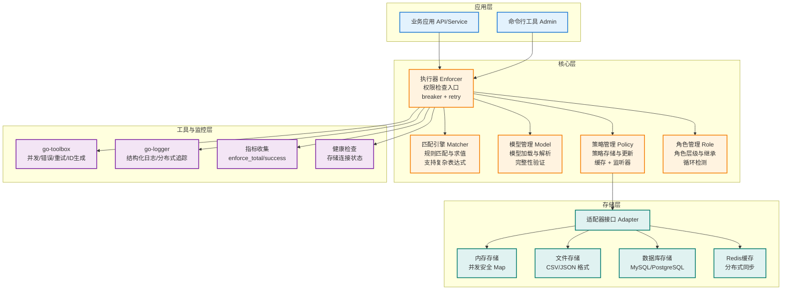

# go-casbin 企业级权限管理系统

## 🎯 项目简介

go-casbin 是一个企业级的权限管理系统，基于 Go 语言开发，深度集成 [go-toolbox](https://github.com/kamalyes/go-toolbox) 和 [go-logger](https://github.com/kamalyes/go-logger)，提供全面、高效、可扩展的权限控制解决方案。

### 核心特性

- 📦 **全面性设计**：完整支持 ACL、RBAC、ABAC 等多种权限模型
- 🔧 **高度可扩展**：基于接口的适配器模式，支持自定义存储后端
- 🚀 **高性能**：利用 go-toolbox 的 syncx.Map、WorkerPool、对象池等优化并发性能
- 🛡️ **高可用**：集成 breaker 熔断器 + retry 重试机制，保障系统稳定性
- 🔍 **可观测性**：深度集成 go-logger，支持结构化日志、分布式追踪、Console风格
- 🔄 **热更新**：策略和配置支持运行时热加载，无需重启
- ⚡ **规则引擎**：基于 go-toolbox matcher 的高性能规则匹配引擎
- 🔐 **安全脱敏**：集成 desensitize 模块，日志自动脱敏

## 📖 权限模型对比：ACL vs RBAC vs ABAC vs PBAC

> 理解不同权限模型的本质区别，是正确选择和使用 go-casbin 的前提

### 核心区别一览

| 维度        | ACL                 | RBAC                      | ABAC                           | PBAC                        |
| --------- | ------------------- | ------------------------- | ------------------------------ | --------------------------- |
| **全称**    | Access Control List | Role-Based Access Control | Attribute-Based Access Control | Policy-Based Access Control |
| **核心思想**  | 主体 → 资源 的直接映射       | 主体 → 角色 → 资源 的间接映射        | 根据主体/资源/环境的**属性**动态判断          | 根据**策略规则**动态判断              |
| **判断依据**  | 固定的用户-权限对           | 用户所属的角色                   | 请求中的属性值                        | 策略文件/数据库中的规则                |
| **策略存储**  | 每个资源维护一个访问列表        | 角色-权限表 + 用户-角色表           | 通常不需要策略文件（matcher 写死）          | 策略文件/数据库（规则可动态管理）           |
| **灵活性**   | ⭐ 最低                | ⭐⭐ 中等                     | ⭐⭐⭐⭐ 最高                        | ⭐⭐⭐⭐ 最高                     |
| **管理复杂度** | ⭐⭐⭐⭐ 最高（用户多时爆炸）     | ⭐⭐ 低                      | ⭐⭐⭐ 中等                         | ⭐⭐⭐ 中等                      |
| **运行时变更** | 需修改策略               | 需修改角色/策略                  | 需修改 matcher（重启）                | 修改策略即可（热更新）                 |

### 本质区别

**ACL** — "谁能做什么"

```
直接绑定：alice → data1:read
问题：100 个用户 × 100 个资源 = 10000 条规则，维护成本爆炸
```

**RBAC** — "谁是什么角色，角色能做什么"

```
间接绑定：alice → admin → data1:read
优势：新增用户只需分配角色，角色权限集中管理
局限：权限判断只看"角色"，无法根据上下文动态调整
```

**ABAC** — "根据属性动态判断"

```
属性匹配：r.sub == r.obj.Owner（只有资源所有者能访问）
优势：无需预定义策略，matcher 表达式直接描述业务规则
局限：规则写死在 model.conf 中，修改需要重启服务
两种模式：
  - 属性匹配模式：matcher 写死，不需要策略文件
  - 规则策略模式：条件表达式存策略文件，eval() 动态执行，支持热更新
```

**PBAC** — "根据策略规则动态判断"

```
策略驱动：策略文件/数据库中定义规则，运行时可增删改
本质：ABAC 规则策略模式就是一种 PBAC 实现
优势：规则与代码解耦，支持运行时热更新，无需重启
```

### go-casbin 中的对应实现

| 模型          | 模型文件                           | 策略文件                           | matcher 特点                                            | 适用场景        |
| ----------- | ------------------------------ | ------------------------------ | ----------------------------------------------------- | ----------- |
| ACL         | `acl_model.conf`               | `acl_policy.csv`               | `r.sub == p.sub && r.obj == p.obj && r.act == p.act`  | 简单系统、用户少    |
| RBAC        | `rbac_model.conf`              | `rbac_policy.csv`              | `g(r.sub, p.sub) && r.obj == p.obj && r.act == p.act` | 企业内部系统、角色明确 |
| RBAC Domain | `rbac_with_domains_model.conf` | `rbac_with_domains_policy.csv` | `g(r.sub, p.sub, r.dom) && ...`                       | 多租户 SaaS    |
| ABAC 属性     | `abac_model.conf`              | 不需要                            | `r.sub == r.obj.Owner`                                | 资源所有者判断     |
| ABAC 规则     | `abac_rule_model.conf`         | `abac_rule_policy.csv`         | `eval(p.sub_rule) && ...`                             | 需要动态规则的场景   |

### 如何选择？

```
用户少、权限简单？                        → ACL
用户多、角色明确、权限相对固定？            → RBAC
多租户、需要租户隔离？                     → RBAC Domain
需要根据资源属性（如所有者）动态判断？       → ABAC 属性匹配
需要运行时动态增删权限规则？                → ABAC 规则策略（PBAC）
多租户 + 角色继承 + 资源通配符？            → Kronos 模型（RBAC Domain + keyMatch3）
```

### Kronos 真实场景模型

Kronos 项目使用的是 **RBAC Domain + 资源通配符** 的混合模型：

```ini
[request_definition]
r = sub, dom, obj, act

[policy_definition]
p = sub, dom, obj, act

[role_definition]
g = _, _, _

[policy_effect]
e = some(where (p.eft == allow))

[matchers]
m = g(r.sub, p.sub, r.dom) && keyMatch3(r.obj, p.obj) && (r.act == p.act || p.act == "*")
```

**三级域隔离**：

- 租户级：`tenantID`（全局权限）
- 平台级：`tenantID::platformID`（平台权限）
- 地区级：`tenantID::platformID/regionCode`（地区权限）

**策略示例**：

```
# Owner 角色在租户全局域拥有所有权限
p, role:owner, tenant123, *, *

# Admin 角色在平台域拥有 /api/* 下所有接口权限
p, role:admin-uuid, tenant123::platform-uuid, /api/*, *

# 用户绑定角色（g 段）
g, user-uuid, role:admin-uuid, tenant123::platform-uuid
```

## 🏗️ 架构设计

### 架构层次图



### 核心组件

- **执行器 (Enforcer)**：系统核心，负责权限检查的统一入口，集成熔断器和重试机制
- **匹配引擎 (Matcher)**：基于 go-toolbox/matcher 的高性能规则匹配引擎，支持复杂表达式解析
- **模型管理 (Model)**：处理权限模型的加载、验证和解析，支持多种权限模型
- **策略管理 (Policy)**：管理权限策略的存储、加载和更新，支持多种存储后端
- **角色管理 (Role)**：处理角色层级关系，支持角色继承和多租户隔离

### 扩展能力

- **适配器系统**：基于接口的适配器模式，支持文件、内存、数据库等多种存储后端
- **监控体系**：集成指标收集和健康检查，提供系统运行状态的可视化
- **企业级特性**：熔断、重试、分布式追踪、结构化日志等企业级功能
- **多租户支持**：基于域的多租户隔离方案，支持复杂的权限隔离需求

## 🚀 快速开始

### 安装

```bash
go get github.com/kamalyes/go-casbin
```

### 基础示例 - RBAC

```go
package main

import (
    "github.com/kamalyes/go-casbin/enforcer"
    "github.com/kamalyes/go-logger"
)

func main() {
    log := logger.NewLogger().WithLevel(logger.INFO)

    // 创建执行器
    e, err := enforcer.NewEnforcer(
        enforcer.WithModelPath("resources/rbac_model.conf"),
        enforcer.WithPolicyPath("resources/rbac_policy.csv"),
        enforcer.WithLogger(log),
    )
    if err != nil {
        log.Fatal("创建执行器失败: %v", err)
    }

    // 权限检查
    ok, err := e.Enforce("alice", "data1", "read")
    log.InfoKV("权限检查结果", "sub", "alice", "obj", "data1", "act", "read", "ok", ok)
}
```

### 详细使用指南

更多详细的使用示例和指南，请参考 `docs/` 目录：

- [快速开始](docs/quickstart.md) - 一步一步教你使用 go-casbin
- [入门指南](docs/getting-started.md) - 从安装到基本使用的完整指南
- [模型配置指南](docs/model-config.md) - 详细的模型配置语法和示例
- [策略管理指南](docs/policy-management.md) - 策略的加载、保存、添加、删除和更新
- [角色管理指南](docs/role-management.md) - 角色的创建、继承、查询和管理
- [多租户指南](docs/multitenancy.md) - 多租户隔离方案和实现方法
- [适配器使用指南](docs/adapters.md) - 各种存储适配器的使用方法
- [高级特性指南](docs/advanced-features.md) - 熔断、重试、分布式追踪等企业级功能
- [实时风控与反黑产](docs/risk-control.md) - 实时风险评估和反黑产操作

## 📂 可运行示例

所有示例代码位于 `examples/` 目录，可直接运行验证效果：

| 示例                                                                 | 说明                               | 运行命令                                                       |
| ------------------------------------------------------------------ | -------------------------------- | ---------------------------------------------------------- |
| [rbac\_basic](examples/rbac_basic/main.go)                         | RBAC 基本使用：角色继承 + 权限检查            | `go run examples/rbac_basic/main.go`                       |
| [abac\_attribute](examples/abac_attribute/main.go)                 | ABAC 属性匹配：基于资源 Owner 字段判断        | `go run examples/abac_attribute/main.go`                   |
| [abac\_rule](examples/abac_rule/main.go)                           | ABAC 规则策略：eval() 动态求值 + 独立 CSV   | `go run examples/abac_rule/main.go`                        |
| [acl\_basic](examples/acl_basic/main.go)                           | ACL 基本使用：无角色的直接权限控制              | `go run examples/acl_basic/main.go`                        |
| [rbac\_domains](examples/rbac_domains/main.go)                     | 多租户 RBAC：域隔离 + 角色管理 API          | `go run examples/rbac_domains/main.go`                     |
| [enterprise\_multitenant](examples/enterprise_multitenant/main.go) | 企业级多租户：options 组合 + 熔断 + 重试      | `go run examples/enterprise_multitenant/main.go`           |
| [enterprise\_full](examples/enterprise_full/main.go)               | 完整企业级：ORM + Redis + 分布式同步（需外部服务） | `go run -tags enterprise examples/enterprise_full/main.go` |

> **注意**：`enterprise_full` 示例需要 MySQL、Redis 等外部服务，使用 `//go:build enterprise` 构建标签隔离，需加 `-tags enterprise` 才会编译。

## 📚 详细文档

更详细的使用指南和技术文档位于 `docs/` 目录：

| 文档                                  | 说明                 | 路径                          |
| ----------------------------------- | ------------------ | --------------------------- |
| [快速开始](docs/quickstart.md)          | 一步一步教你使用 go-casbin | `docs/quickstart.md`        |
| [入门指南](docs/getting-started.md)     | 从安装到基本使用的完整指南      | `docs/getting-started.md`   |
| [模型配置指南](docs/model-config.md)      | 详细的模型配置语法和示例       | `docs/model-config.md`      |
| [策略管理指南](docs/policy-management.md) | 策略的加载、保存、添加、删除和更新  | `docs/policy-management.md` |
| [角色管理指南](docs/role-management.md)   | 角色的创建、继承、查询和管理     | `docs/role-management.md`   |
| [多租户指南](docs/multitenancy.md)       | 多租户隔离方案和实现方法       | `docs/multitenancy.md`      |
| [适配器使用指南](docs/adapters.md)         | 各种存储适配器的使用方法       | `docs/adapters.md`          |
| [高级特性指南](docs/advanced-features.md) | 熔断、重试、分布式追踪等企业级功能  | `docs/advanced-features.md` |
| [实时风控与反黑产](docs/risk-control.md)    | 实时风险评估和反黑产操作       | `docs/risk-control.md`      |

## 🎯 学习路径

1. **入门阶段**：阅读 [快速开始](docs/quickstart.md) 和 [入门指南](docs/getting-started.md)，掌握基本使用方法
2. **进阶阶段**：学习 [模型配置指南](docs/model-config.md) 和 [策略管理指南](docs/policy-management.md)，了解核心概念
3. **高级阶段**：探索 [多租户指南](docs/multitenancy.md)、[适配器使用指南](docs/adapters.md) 和 [高级特性指南](docs/advanced-features.md)，掌握企业级功能
4. **专家阶段**：研究 [实时风控与反黑产](docs/risk-control.md)，实现完整的权限和风控体系

## 📊 监控与日志

### 结构化日志输出

```
ℹ️ [INFO] 2026-03-29 23:59:00 Enforce result {sub: alice, obj: data1, act: read, ok: true}
ℹ️ [INFO] 2026-03-29 23:59:00 [trace_id=abc123] Policy check completed {duration: 0.15ms, result: allow}
❌ [ERROR] 2026-03-29 23:59:00 Enforce failed {sub: bob, obj: data2, act: write, error: forbidden}
```

### 监控指标

| 指标                | 说明       |
| ----------------- | -------- |
| `enforce_total`   | 权限检查总次数  |
| `enforce_success` | 权限检查成功次数 |
| `enforce_failure` | 权限检查失败次数 |
| `enforce_latency` | 权限检查延迟   |
| `policy_updates`  | 策略更新次数   |
| `cache_hits`      | 缓存命中次数   |
| `cache_misses`    | 缓存未命中次数  |
| `breaker_state`   | 熔断器状态    |

## 🤝 贡献指南

1. Fork 本仓库
2. 创建特性分支 (`git checkout -b feature/amazing-feature`)
3. 提交更改 (`git commit -m 'Add some amazing feature'`)
4. 推送到分支 (`git push origin feature/amazing-feature`)
5. 打开 Pull Request

## 📄 许可证

本项目采用 MIT 许可证 - 详见 [LICENSE](LICENSE) 文件
